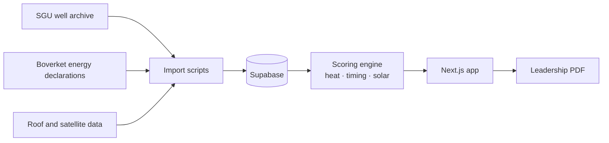

# 🗺️ Huskartan

**Address scoring for Swedish homes, built for marketing that reaches the right house at the right moment.**
Source is private. This is how it works.

## The problem

Heat pumps, solar and batteries only sell when the house is right and the timing is right. Most home energy marketing is aimed at postcodes. Huskartan scores the individual home.

## How it scores

Every address gets three sub-scores that roll up into one:

| Sub-score | Question it answers |
|---|---|
| Heat | How much does this home stand to gain from a new heating system? |
| Timing | Is the household likely to act soon? |
| Solar | How good is the roof? |

Data sources: SGU well archive, Boverket energy declarations, roof and satellite data.

## Architecture

## How it's built

Built with Claude Code across planned sessions, one data source at a time. A `CLAUDE.md` file carries context from session to session, so each run picks up where the last one ended.

## Stack

Next.js · Supabase · Claude Code
