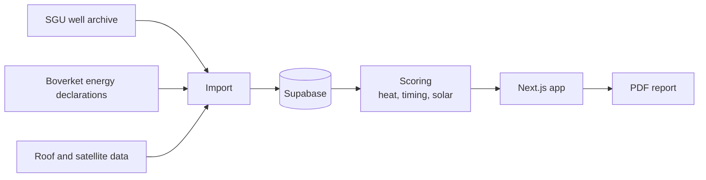

# Huskartan

Scores Swedish houses on how likely they are to be a good fit for a new heating system, and when. The code is private, so this is a short write-up.

Each address gets three sub-scores that combine into one:

| Score | Question |
|---|---|
| Heat | How much could this house gain from a new heating system? |
| Timing | Is the household likely to act soon? |
| Solar | How good is the roof? |

Data comes from the SGU well archive, Boverket's energy declarations and roof and satellite data.

I built it one data source at a time over a series of sessions.

Stack: Next.js, Supabase.
